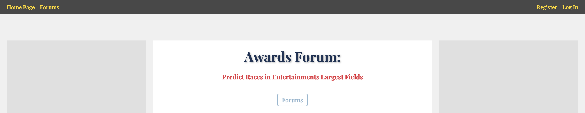

# Awards Forum

[Awards Forum](https://awards-forum-c36b0ddce5e7.herokuapp.com/) is a discussion forum for entertainment industry awards prognostication, inspired by GoldDerby, that utilizes the MEN stack and created as an assignment for a General Assembly Software Engineering Bootcamp.

### Why I Chose This Application

When deciding on a project, I wanted an opportunity to relate my interests to the technologies use to create something functional, community-based, and multifaceted. Concurrent with Unit 2 of my General Assembly Software Engineering Bootcamp, being taugh from October to November in 2024, is the release of the bulk of films intended for awards consideration, sometimes referred to as "Oscar-bait". As a burgeoning cinephile, I actively seek out these films and analyze them for creative and technical accomplishments. GoldDerby is the predominant website for discussion and prognostication of United States-based entertainment awards, filled with users who similarly breakdown and discuss films based on their awards potential. It served as an execellent model for a project with two major applications: a forum for discussion (the MVP) and a prediction center (the level up content).

### How To Use

Awards Forum follows basic CRUD operations using RESTful routing conventions to allow authenticated-users the ability to create conversation topics and contribute to conversations. Any guest can read a thread, but only users can open new threads, edit or delete threads they have created, post comments, and edit or delete comment they have made.

Come join the conversation: https://awards-forum-c36b0ddce5e7.herokuapp.com/

## Technologies Used
The following languages, technologies, framewords, and libraries were implemented to create this game: 

# Attribution
* Trophy FavIcon - <a href="https://www.flaticon.com/free-icons/ui" title="ui icons">Ui icons created by Rhendi Renaldy - Flaticon</a>

# Level Up
Potential features to be added on:
* Prediction Center
    * Full CRUD Functionality
    * For Major Award Categories
    * Incorporate aggregate to landing page, partial template that can be seen anywhere on website
* User pages
    * Add bio, profile photos
    * See all posts by user, all of their predictions
    * Allow Users to DM one another